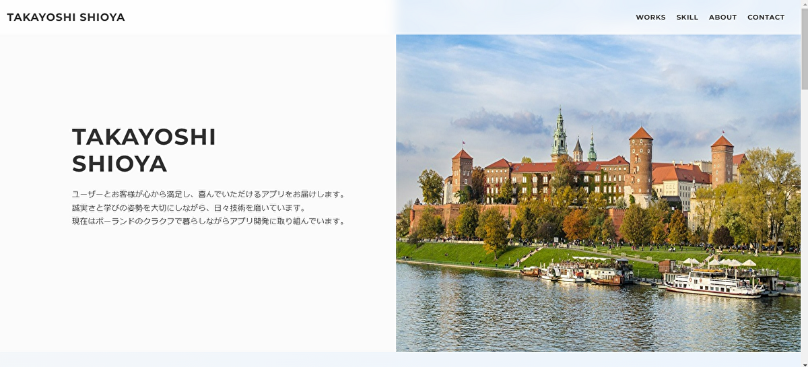

# Takayoshi Shioya Portfolio site



## 概要

私のポートフォリオサイトです。制作物や習得したスキルをご覧いただけます。

今後随時更新していきます。

### ウェブサイトURL

https://t-shioya.com/

### 使用技術

| 言語・その他使用技術 |
| ------------------ |
| HTML               |
| CSS                |
| JavaScript         |
| GitHub Pages       |

### 環境構築

#### リポジトリのクローン作成

- 任意のディレクトリにて
    ```
    git clone git@github.com:basstuba/portfolio-web-site.git
    ```
    を実行してください。

#### ブラウザに表示

- index.htmlファイルをクリックしてブラウザで表示、もしくはお使いのローカルサーバーやテキストエディタにてアクセスしてください。